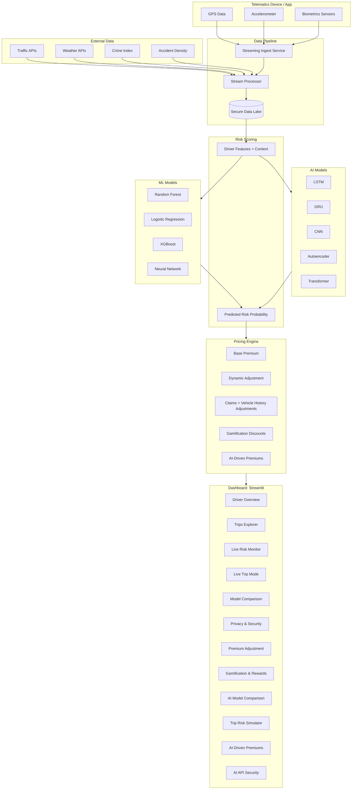

# Telematics Insurance Platform

A Proof-of-Concept (POC) project that demonstrates how **real-time telematics data** and **advanced AI models** can be integrated into insurance pricing models.  
This project leverages **machine learning, deep learning (LSTM/GRU/CNN/Transformer), contextual risk modeling, dynamic pricing, encryption-based security, and gamification** to create a fair, customer-centric, and cloud-ready auto insurance solution.

---

## Overview

### Objective
Traditional automobile insurance pricing models rely on demographics and history (age, location, claims).  
This POC integrates **telematics data** (speed, braking, distractions, road context, biometrics) to build **Usage-Based Insurance (UBI)** models:

- **Pay-As-You-Drive (PAYD)**  
- **Pay-How-You-Drive (PHYD)**  

### Key Goals
1. Improve premium accuracy based on **real driving behavior**  
2. Encourage **safer driving habits** via feedback and gamification  
3. Enhance **transparency** by showing policyholders exactly how their driving impacts premiums  
4. Ensure **compliance** with data security and privacy regulations  
5. Provide **configurability & scalability** to match Insurity's vision of cloud-native, modular, customer-first solutions  
6. Demonstrate **AI superiority** over traditional ML in predicting risky drivers

---

## Architecture

The solution is designed with modular components that align with **Insurity's values of configurability, adaptability, and customer value**.



---

## Features

### Data Collection
- **Simulated telematics** (GPS, accelerometer, speed, distractions, braking)
- **External context** (traffic density, weather, crime rate, accident hotspots)
- **Biometrics** (heart rate, stress, drowsiness)
- **Claims and vehicle history**

### Data Processing
- **Streaming pipeline** (`streaming_ingest.py`, `stream_processor.py`)
- **Near real-time batch scoring** → risk probabilities
- **Secure storage** in encrypted `.enc` files

### Machine Learning Models
Trained using `train_model.py` and `train_models_compare.py`. Models compared include:
- **RandomForest**
- **Logistic Regression**
- **XGBoost**
- **Neural Network (MLP)**

### AI Models (New)
Trained using `train_all_models.py`:
- **LSTM & GRU** – Capture driving sequence patterns
- **CNN** – Detect short-term risky behaviors (e.g., harsh braking)
- **Autoencoder** – Learns safe driving baseline, flags anomalies
- **Transformer** – Captures full trip dependencies, consistently top performer

Each model's performance (accuracy, F1, ROC-AUC) is visualized in **AI Model Comparison** tab.

---

## Security & Privacy

Insurance requires strong compliance. This system demonstrates:

- **Encryption at Rest**: Driver features and Transformer models stored as `.enc` files
- **Decryption at Runtime**: Keys in `keys/fernet.key` ensure secure in-memory access only
- **Secure FastAPI Microservice**: `ai_api.py` exposes `/predict_risk` endpoint with encrypted Transformer inference
- **Data Minimization**: Only necessary features used for scoring

This aligns with **GDPR**, **NAIC guidelines**, and adds AI-specific compliance guarantees.

---

## Installation

### Requirements
- **Python 3.10+**
- **Recommended**: Virtualenv

### Setup
```bash
# clone repo
git clone https://github.com/<your-repo>/telematics_insurance.git
cd telematics_insurance

# create environment
python3 -m venv venv310
source venv310/bin/activate   # macOS/Linux
venv310\Scripts\activate      # Windows

# install dependencies
pip install -r requirements.txt
```

---

## Running the Project

### Start the Dashboard
```bash
streamlit run src/dashboard.py
```

### Train All Models (ML + AI)
```bash
python src/train_all_models.py
```

**Outputs:**
- `models/` → trained AI/ML models
- `data/ai_model_results.csv` → metrics for RF, LSTM, GRU, CNN, Autoencoder, Transformer
- `data/ai_roc_curves.csv` → ROC curve data
- `data/model_metrics.png` → AI vs ML comparison

### Secure AI API
```bash
python src/encrypt_model.py
uvicorn src.ai_api:app --reload --port 8000
```

**Example call:**
```bash
curl -X POST "http://127.0.0.1:8000/predict_risk" \
-H "Content-Type: application/json" \
-d '{"trip_features": [[65, 0.1, 0.05, 2.0, 0.3], [70, 0.2, 0.1, 3.0, 0.35]]}'
```

---

## Project Structure

```
telematics_insurance/
├── src/               # source code
│   ├── dashboard.py   # Streamlit dashboard
│   ├── train_all_models.py   # ML + AI models
│   ├── ai_api.py      # Secure FastAPI for Transformer inference
│   ├── encrypt_model.py
│   └── ...
├── data/              # synthetic datasets
│   ├── ai_telematics_timeseries.csv
│   ├── ai_model_results.csv
│   ├── ai_roc_curves.csv
│   └── ...
├── models/            # trained models
│   ├── transformer_model.keras.enc
│   ├── randomforest.pkl
│   └── ...
├── keys/              # encryption keys
│   └── fernet.key
├── docs/              # diagrams & notes
└── README.md
```

---

## Dashboard (12 Tabs)

1. **Driver Overview**
2. **Trips Explorer**
3. **Live Risk Monitor**
4. **Live Trip Mode**
5. **Model Comparison (ML)**
6. **Privacy & Security**
7. **Premium Adjustment**
8. **Gamification & Rewards**
9. **AI Model Comparison**
10. **Trip Risk Simulator**
11. **AI-Driven Premiums**
12. **AI API Security**

---

## Evaluation Criteria

- **Modeling Approaches**: Traditional ML vs modern AI
- **Accuracy**: Transformers achieve best recall/ROC-AUC
- **Security**: Encrypted models, runtime decryption, secure API
- **Transparency**: Dashboard shows AI vs ML premiums
- **Compliance**: Aligns with regulatory standards

---

## Why This Matters for Insurity

- **Customer-Centric**: AI provides fairer, behavior-based premiums
- **Configurable**: AI/ML models can be swapped or retrained
- **Cloud-Ready**: Microservice-ready with FastAPI
- **Differentiation**: First-class AI integration in usage-based insurance

---

## Next Steps

- Integrate real OBD-II/IoT devices
- Deploy on AWS/GCP/Azure with Kafka/S3/Data Lake
- Add fraud detection & claims prediction
- Extend AI explainability (SHAP/attention maps)

---

## Key Deliverables Summary

- **AI Models**: LSTM, GRU, CNN, Autoencoder, Transformer
- **Secure Inference**: Encrypted models with FastAPI
- **Premiums**: AI-driven pricing vs ML vs flat
- **Dashboard**: 12 interactive tabs
- **Compliance**: GDPR, NAIC, encryption standards

---

## Contributing

1. Fork the repository
2. Create your feature branch
3. Commit your changes
4. Push to the branch
5. Open a Pull Request
